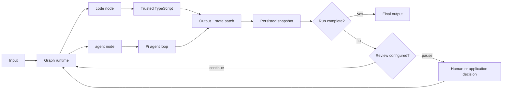

# mini-pie

English | [简体中文](./README.zh-CN.md)

A minimal, headless TypeScript agent and graph framework built on [Pi](https://github.com/earendil-works/pi).

mini-pie is for applications where an agent is more than a prompt. A useful agent usually includes deterministic input parsing, model-driven reasoning, tools, output validation, state transitions, review points, and code that decides what happens next. mini-pie keeps those parts together as a small, inspectable software unit.

The framework keeps Pi's streaming agent loop, state model, provider adapters, and coding tools. It adds only the configuration, code-node, graph, checkpoint, and persistence layers needed to compose those agents into applications.

## Why mini-pie

A prompt-only abstraction is convenient at the beginning, but it becomes limiting when the agent needs application logic:

- raw input must be parsed or enriched before it reaches the model;
- model output must be validated, normalized, or converted into domain data;
- deterministic code should make decisions that do not require another model call;
- several agents may need to run in parallel and exchange structured results;
- execution may need to pause for inspection, editing, approval, or takeover;
- a stopped process must be able to resume without replaying completed work.

mini-pie models this as a graph of deterministic `code` nodes and probabilistic `agent` nodes. A single agent, an agent with hooks, a multi-agent workflow, and a larger agent/code application all use the same execution model.

This is mini-pie's interpretation of graph engineering: the graph is the source-visible architecture of the agent application, not merely a visual chain of prompts. Nodes expose where deterministic and model-driven behavior live, edges expose control flow, bindings expose data flow, and persisted state exposes what happened at runtime.

## Design philosophy

### 1. Keep the primitive set small

The runtime has only two executable node types:

| Node | Responsibility |
| --- | --- |
| `agent` | Semantic work through a Pi agent loop, model, prompt, and tools |
| `code` | Deterministic parsing, validation, transformation, integration, and routing data |

Hooks are not a third primitive. They compile into ordinary code nodes before or after an agent. Workflows are not a separate runtime either; they are graph units built from the same two nodes.

Minimal here means a small set of composable concepts, not a restricted execution model.

### 2. Treat an agent as a software unit, not a prompt file

Each `units/<name>/` directory owns everything required to run that agent or graph:

- its `unit.yaml` definition;
- system and user prompts;
- TypeScript code nodes and hooks;
- schemas and other local resources.

The top-level configuration only registers models, storage, workspace, and unit locations. This keeps a unit movable, reviewable, and versionable as one piece instead of spreading its behavior across a global configuration file.

### 3. Put deterministic logic around probabilistic logic

Language models are useful for interpretation, planning, and generation. They are a poor substitute for ordinary code when the operation is already known.

mini-pie therefore encourages a direct split:

- use code to parse inputs, enforce schemas, call application services, calculate values, and classify explicit states;
- use agents where reasoning over ambiguous or unstructured information is required;
- connect both with edges so the boundary is visible.

This makes model calls easier to test and keeps business rules out of prompts.

### 4. Use configuration for structure and TypeScript for behavior

YAML describes stable topology: nodes, edges, bindings, retries, timeouts, concurrency, and review points. TypeScript implements behavior that benefits from types, libraries, tests, and normal source control.

mini-pie deliberately has no embedded expression language. Structured `$ref` bindings cover data movement, while non-trivial computation stays in code nodes.

### 5. Make data flow and state explicit

Nodes communicate through four visible namespaces: immutable `input`, mutable `state`, node `results`, and `runtime` metadata. Edges control execution; `$ref` bindings control data movement.

There is no hidden shared conversation across graph nodes. Agent nodes receive an explicit input, code nodes return an explicit output and optional `statePatch`, and the latest node result is inspectable in the run snapshot.

### 6. Make interruption a normal state

Human review is part of graph execution rather than a UI feature. Any node can pause before or after execution. The caller can approve, edit, retry, skip, override, take over, or abort, then resume in the same or another process.

The checkpoint is persisted before control returns to the caller. This makes debugging, approval, and operational takeover use the same mechanism.

### 7. Prefer local and inspectable infrastructure

Configuration is YAML, unit behavior is TypeScript, sessions and graph runs are JSONL, and there is no required server or database. A run can be understood from files in the repository and its persisted event log.

The defaults fit local tools, scripts, CI jobs, and application backends. A larger system can replace or wrap these boundaries without changing the node model.

### 8. Build on Pi instead of rebuilding the agent loop

Pi already provides the difficult model-facing foundation: streaming, tool execution, agent state, provider adapters, cancellation, and message handling. mini-pie depends on that foundation and focuses on reusable definitions and graph execution.

The result is a thin framework layer rather than another model SDK or a fork of Pi.

## Execution model



The graph scheduler activates entry nodes, resolves their inputs, runs ready nodes up to the concurrency limit, persists results, evaluates outgoing edge conditions, and activates the next nodes. Cycles use the same process and are bounded by step and visit limits.

An agent with hooks is compiled into the same model:

```text
input -> before code hooks -> Pi agent -> after code hooks -> output
```

This shared representation is the central design choice: a standalone agent can grow into a graph without moving to another API or orchestration system.

## Deliberate non-goals

mini-pie is not intended to be a hosted agent platform. It intentionally does not include:

- a UI, HTTP server, or deployment control plane;
- a database, queue, or distributed scheduler;
- an MCP layer or plugin marketplace;
- a second programming language hidden inside YAML;
- an operating-system sandbox.

Code nodes and tools execute with the permissions of the mini-pie process. Applications that run untrusted work should provide an external sandbox.

## Capabilities

- Define a standalone agent with a model, system prompt, user prompt, and tools.
- Register agents and graphs from self-contained `units/<name>/` directories.
- Run code before or after an agent through hooks.
- Connect agent and code nodes with explicit edges and structured `$ref` bindings.
- Use conditional branches, parallel nodes, joins, retries, timeouts, and guarded cycles.
- Pause before or after any node for human review, then resume from a persisted checkpoint.
- Persist graph events and snapshots as readable JSONL.
- Persist optional direct-agent conversations as JSONL sessions.
- Prune older tool results and summarize old agent context.

Supported model APIs:

- OpenAI Responses
- Anthropic Messages
- OpenAI-compatible Chat Completions

## Requirements

- Node.js 22.19 or newer
- Unit code is trusted and may execute with the permissions of the mini-pie process

## Install

```bash
git clone https://github.com/lkpsg/mini-pie.git
cd mini-pie
npm install --ignore-scripts
npm run build
```

## Environment variables

Create a local `.env` from the tracked empty template, then fill in the OpenAI service URL, API key, and model:

```bash
cp .env.example .env
```

```dotenv
OPENAI_BASE_URL=https://api.openai.com/v1
OPENAI_API_KEY=sk-...
OPENAI_MODEL=gpt-5
```

`.env` is ignored by Git; `.env.example` is committed with the same variable names and empty values. `loadConfig()` automatically loads the first `.env` found next to the configuration file or in the current working directory. Environment variables already supplied by the parent process take precedence over values in the file.

## Project layout

```text
.env
.env.example
mini-pie.yaml
units/
  researcher/
    unit.yaml
    prompts/
      system.md
  report-graph/
    unit.yaml
    src/
      nodes.ts
    schemas/
```

The top-level file registers models, storage, and unit directories. Prompts, code, and other resources stay with the unit that owns them.

```yaml
version: 2
workspace: .

storage:
  directory: .mini-pie/runs

models:
  main:
    api: openai-responses
    provider: openai
    model: ${OPENAI_MODEL}
    baseUrl: ${OPENAI_BASE_URL}
    apiKeyEnv: OPENAI_API_KEY
    reasoning: true

units:
  researcher: ./units/researcher
  report-graph: ./units/report-graph
```

`${ENVIRONMENT_VARIABLE}` placeholders are expanded in top-level and unit YAML files. Models sharing a provider id also share its API-key environment variable.

## Agent units

`units/researcher/unit.yaml`:

```yaml
kind: agent
model: main
systemPrompt:
  file: ./prompts/system.md
userPrompt: "Research this request:\n\n{{input}}"
tools: [read, grep, find, ls, http_request]
thinking: medium
maxTurns: 24
maxToolCalls: 48
```

A configured `subagents` list gives the parent a `delegate` tool. Subagents share the workspace but not conversation history, and nested delegation is disabled.

## Agent hooks

Hooks are shorthand for visible code nodes around the agent node. They use the same persistence, retry, timeout, state, and review behavior as code nodes in a graph.

```yaml
kind: agent
model: main
systemPrompt: You are a precise analyst.
hooks:
  before:
    - id: parse_input
      entry: ./src/hooks.ts#parseInput
      params:
        strict: true
  after:
    - id: normalize_output
      entry: ./src/hooks.ts#normalizeOutput
      review:
        after: true
```

When no hook `input` is configured, the first hook receives the unit input and each later hook receives the preceding output. The agent receives the last `before` output, and the first `after` hook receives the agent output.

## Code nodes

Code entries use `./file.ts#exportName` and resolve relative to the unit directory. Node.js 22 runs erasable TypeScript directly.

```ts
import { defineCodeNode, Type } from "mini-pie";

export const parseInput = defineCodeNode({
  input: Type.Object({ raw: Type.String() }),
  output: Type.Object({ value: Type.String() }),
  params: Type.Object({ strict: Type.Boolean() }),
  async run({ input, params, state, signal, runtime }) {
    if (signal.aborted) throw new Error("Operation aborted");
    const value = params.strict ? input.raw.trim() : input.raw;
    return {
      output: { value },
      statePatch: { parsedBy: runtime.node },
    };
  },
});
```

Inputs, params, and outputs are checked against their TypeBox schemas. A code node must return `{ output, statePatch? }`. `statePatch` is merged into graph state after the node succeeds and any `after` review is approved.

Code modules are trusted application code. mini-pie does not sandbox them.

## Graph units

```yaml
kind: graph
entry: parse
maxSteps: 64
maxVisits: 4
maxConcurrency: 4

nodes:
  parse:
    type: code
    entry: ./src/nodes.ts#parse
    input:
      raw:
        $ref: input

  analyze:
    type: agent
    unit: researcher
    input:
      $ref: results.parse.output.value
    retry: 1
    timeoutMs: 120000

  decide:
    type: code
    entry: ./src/nodes.ts#decide
    input:
      $ref: results.analyze.output
    review:
      after: true
      message: Check the decision before continuing.

edges:
  - from: parse
    to: analyze
  - from: analyze
    to: decide
  - from: decide
    to: analyze
    when:
      path: results.decide.output.status
      equals: retry

output:
  $ref: results.decide.output
```

An agent node references an agent unit and executes its Pi agent definition. A code node executes a registered TypeScript entry. An agent unit's hooks apply when that agent unit is run as an entry unit; graph authors place explicit code nodes around agent nodes when composing a larger graph.

### Data model

Every binding and condition can read four namespaces:

- `input`: immutable graph input
- `state`: mutable values produced by `statePatch`
- `results.<node>`: latest result for each node
- `runtime`: run id, unit, status, step count, and visit counts

A record containing only `$ref` is replaced with the referenced value. Arrays and objects are resolved recursively, so nodes exchange structured data without converting everything to prompt strings.

### Scheduling

- Nodes with no incoming edge are entries when `entry` is omitted.
- Ready nodes run concurrently up to `maxConcurrency`.
- Nodes sharing a `concurrencyKey` never run in the same batch.
- `join: all` waits for every incoming source; `join: any` accepts the first activation.
- `edgeMode: all` activates every matching outgoing edge; `edgeMode: first` activates only the first match.
- Edge conditions support `path`, `exists`, `equals`, and `notEquals`.
- Cycles are allowed and guarded by `maxSteps` and per-node `maxVisits`.
- `retry` is the number of automatic retries after the first attempt.

## Human review and resume

Any node may pause before execution, after execution, or both:

```yaml
review:
  before: true
  after: true
  message: Inspect inputs and output.
```

Without a `ReviewHandler`, `runUnit()` returns `status: "waiting_review"` with a checkpoint request. The complete snapshot is already persisted and can be resumed in another process.

```ts
const paused = await runtime.runUnit("report-graph", input);

if (paused.status === "waiting_review") {
  const completed = await runtime.resume(paused.runId, {
    action: "edit",
    value: { approved: true },
  });
}
```

Review actions:

| Action | Behavior |
| --- | --- |
| `approve` | Continue or accept the staged output |
| `retry` | Execute the node again |
| `edit` | Replace the input before execution or output after execution |
| `skip` | Complete the node as skipped with an optional value |
| `override` | Complete the node without execution using the supplied value |
| `takeover` | Record a human-produced value and complete the node |
| `abort` | Abort the graph run |

Applications can provide a `ReviewHandler` to answer review requests immediately:

```ts
const runtime = await createRuntime(config, {
  baseDir,
  reviewHandler: {
    async review(request) {
      console.error(`Review ${request.node} (${request.phase})`);
      return { action: "approve" };
    },
  },
});
```

## TypeScript API

Load config and run any registered unit:

```ts
import { createRuntime, loadConfig } from "mini-pie";

const loaded = await loadConfig("mini-pie.yaml");
const runtime = await createRuntime(loaded.config, { baseDir: loaded.baseDir });
const result = await runtime.runUnit("report-graph", { topic: "Pi" });

console.log(result.status, result.output, result.runId);
```

`runWorkflow()` is an alias for `runUnit()`.

For the smallest standalone agent without unit files, use `defineAgent()`:

```ts
import { defineAgent } from "mini-pie";

const agent = await defineAgent({
  model: {
    api: "openai-responses",
    provider: "openai",
    model: "gpt-5",
    apiKeyEnv: "OPENAI_API_KEY",
  },
  systemPrompt: "You are a precise coding agent.",
  userPrompt: "Complete this task:\n\n{{input}}",
  tools: ["read", "write", "edit", "bash", "grep", "find", "ls"],
  workspace: process.cwd(),
});

try {
  const result = await agent.run("Find and fix the bug.");
  console.log(result.text);
} finally {
  await agent.close();
}
```

`MiniPieAgent.stream()` emits text and tool lifecycle events. `MiniPieRuntime.createAgent()` exposes the same direct-agent API for a configured agent unit; graph hooks are intentionally handled by `runUnit()`.

## CLI

```bash
mini-pie units --config mini-pie.yaml
mini-pie run report-graph "Research graph engineering" --config mini-pie.yaml
mini-pie resume <run-id> approve --config mini-pie.yaml

# Direct streaming agent execution and conversation sessions
mini-pie agent researcher "Inspect the parser" --config mini-pie.yaml
mini-pie agent researcher "Continue" --session my-session --config mini-pie.yaml
```

Use `--json` for machine-readable output. `--session new` generates a direct-agent session id. Graph state always has a run id and persisted JSONL log.

## Examples

The [`examples`](./examples/README.md) directory introduces the framework through four progressive text-processing examples:

1. a minimal configured Agent;
2. an Agent with deterministic before and after Hooks;
3. a Code → Agent → review → Code Graph with persisted resume;
4. a Code Node that dynamically routes execution to one of two Agent Nodes.

Each example is intentionally small and uses the same model configured through the root `.env`.

## Built-in tools

| Tool | Purpose |
| --- | --- |
| `read` | Read text and supported images with truncation |
| `write` | Create or overwrite a file |
| `edit` | Apply exact text replacements |
| `bash` | Execute a shell command |
| `grep` | Search text files with a regular expression |
| `find` | Find files by glob |
| `ls` | List a directory |
| `http_request` | Make an HTTP request |
| `sleep` | Wait for up to 60 seconds |
| `todo` | Maintain an in-memory agent task list |

Tools are opt-in per agent. Custom tools remain available through `defineTool()` and the runtime `tools` option.

## State and persistence

Graph JSONL files contain lifecycle events followed by full snapshots. Node statuses are `pending`, `running`, `waiting_review`, `succeeded`, `failed`, `skipped`, or `cancelled`. Run statuses are `running`, `waiting_review`, `succeeded`, `failed`, or `aborted`.

Agent state is managed by `@earendil-works/pi-agent-core`. Context compaction first replaces old tool-result bodies, then asks the active model to summarize older turns. Full messages remain in agent state and direct-agent session JSONL; compaction only changes context sent to the model.

## Security model

mini-pie has no OS sandbox.

- File tools reject paths outside the configured workspace, including symlink escapes.
- `bash` runs with the permissions of the current process and can access paths outside the workspace.
- `http_request` can reach arbitrary HTTP and HTTPS endpoints available to the process.
- Code nodes and custom tools are trusted application code.
- Human review is a workflow checkpoint, not a security boundary.

Use a container or another sandbox when running untrusted prompts, code, or repositories.

## Development

Keep `README.md` and `README.zh-CN.md` synchronized whenever documentation changes.

```bash
npm run check
npm test
npm run build
```

The complete runnable walkthrough is in [`examples/README.md`](./examples/README.md).

## License and attribution

mini-pie is released under the MIT License. It depends on the MIT-licensed Pi packages `@earendil-works/pi-agent-core` and `@earendil-works/pi-ai`. See [`THIRD_PARTY_NOTICES.md`](./THIRD_PARTY_NOTICES.md) for upstream attribution and license text.
