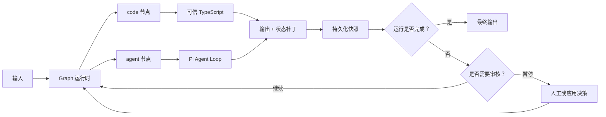

# mini-pie

[English](./README.md) | 简体中文

一个基于 [Pi](https://github.com/earendil-works/pi) 构建的极简、无界面 TypeScript Agent 与 Graph 框架。

mini-pie 面向的场景是：Agent 不只是一个 Prompt。一个真正可用的 Agent 通常还包含确定性的输入解析、模型驱动的推理、工具、输出校验、状态转换、审核点，以及决定下一步执行逻辑的代码。mini-pie 将这些内容组织成一个小型、可检查的软件单元。

框架保留了 Pi 的流式 Agent Loop、状态模型、模型提供商适配器和编码工具，只增加了将 Agent 组合成应用所必需的配置、Code Node、Graph、Checkpoint 和持久化层。

## 为什么需要 mini-pie

只使用 Prompt 的抽象在初期很方便，但当 Agent 需要应用逻辑时，很快就会遇到限制：

- 原始输入需要在进入模型前进行解析或补充；
- 模型输出需要校验、标准化或转换为领域数据；
- 已知的确定性决策不应再消耗一次模型调用；
- 多个 Agent 可能需要并行运行并交换结构化结果；
- 执行过程可能需要暂停，以便检查、编辑、审批或人工接管；
- 进程停止后应当能够恢复，而不必重新执行已经完成的工作。

mini-pie 将这些需求建模为由确定性 `code` 节点和概率性 `agent` 节点组成的 Graph。单 Agent、带 Hook 的 Agent、多 Agent Workflow，以及更大的 Agent/Code 应用都使用同一套执行模型。

这就是 mini-pie 对 Graph Engineering 的理解：Graph 是 Agent 应用在源码层面可见的架构，而不只是一个可视化的 Prompt 链。节点展示确定性行为和模型驱动行为所在的位置，边展示控制流，绑定展示数据流，持久化状态展示运行时实际发生的过程。

## 设计理念

### 1. 保持最小的基础原语集合

运行时只有两种可执行节点：

| 节点 | 职责 |
| --- | --- |
| `agent` | 通过 Pi Agent Loop、模型、Prompt 和工具完成语义工作 |
| `code` | 完成确定性的解析、校验、转换、集成和数据路由 |

Hook 不是第三种原语，它会被编译为 Agent 前后的普通 Code Node。Workflow 也不是另一套运行时，而是由相同两类节点构成的 Graph Unit。

这里的“极简”意味着使用少量可组合的概念，而不是限制执行能力。

### 2. 将 Agent 视为软件单元，而不是 Prompt 文件

每个 `units/<name>/` 目录都包含运行该 Agent 或 Graph 所需的全部内容：

- `unit.yaml` 定义；
- System Prompt 和 User Prompt；
- TypeScript Code Node 和 Hook；
- Schema 及其他本地资源。

顶层配置只注册模型、存储、工作区和 Unit 位置。这样一个 Unit 就可以作为整体被移动、审查和版本管理，而不必将行为分散到全局配置文件中。

### 3. 用确定性逻辑包围概率性逻辑

语言模型适合解释、规划和生成。当操作本身已经明确时，它并不能替代普通代码。

因此，mini-pie 鼓励明确划分职责：

- 使用代码解析输入、执行 Schema 校验、调用应用服务、计算数值和判断明确状态；
- 在需要处理模糊或非结构化信息时使用 Agent；
- 使用边连接二者，使职责边界在 Graph 中可见。

这种设计让模型调用更容易测试，并避免把业务规则隐藏在 Prompt 中。

### 4. 配置描述结构，TypeScript 实现行为

YAML 描述稳定的拓扑结构：节点、边、绑定、重试、超时、并发和审核点。TypeScript 负责那些需要类型、第三方库、测试和正常源码管理的行为。

mini-pie 刻意不提供嵌入式表达式语言。结构化 `$ref` 绑定负责数据传递，非简单计算则保留在 Code Node 中。

### 5. 显式表达数据流和状态

节点通过四个可见命名空间通信：不可变的 `input`、可变的 `state`、节点 `results` 和 `runtime` 元数据。边控制执行过程，`$ref` 绑定控制数据移动。

Graph Node 之间不存在隐藏的共享会话。Agent Node 接收显式输入，Code Node 返回显式输出和可选的 `statePatch`，每个节点的最新结果都可以在运行快照中检查。

### 6. 将中断视为正常状态

人工审核属于 Graph 执行模型的一部分，而不是 UI 功能。任意节点都可以在执行前或执行后暂停。调用方可以批准、编辑、重试、跳过、覆盖、接管或终止，然后在当前进程或另一个进程中恢复执行。

Checkpoint 会在控制权返回调用方之前完成持久化。因此，调试、审批和运行时接管可以使用同一套机制。

### 7. 优先选择本地、可检查的基础设施

配置使用 YAML，Unit 行为使用 TypeScript，会话和 Graph Run 使用 JSONL，不需要服务器或数据库。只需要查看仓库文件和持久化事件日志，就能理解一次运行。

默认实现适用于本地工具、脚本、CI 任务和应用后端。更大的系统可以替换或包装这些边界，而无需改变节点模型。

### 8. 基于 Pi 构建，而不是重新实现 Agent Loop

Pi 已经提供了复杂的模型交互基础：流式输出、工具执行、Agent 状态、模型提供商适配、取消和消息处理。mini-pie 依赖这些能力，将注意力集中在可复用定义和 Graph 执行上。

因此，mini-pie 是一个轻量框架层，而不是另一个模型 SDK，也不是 Pi 的 Fork。

## 执行模型



Graph 调度器激活入口节点、解析节点输入、在并发限制内运行就绪节点、持久化结果、计算出边条件并激活后续节点。循环使用同一执行过程，并受到最大步骤数和节点访问次数的限制。

带 Hook 的 Agent 会被编译为同一种模型：

```text
输入 -> 前置 Code Hook -> Pi Agent -> 后置 Code Hook -> 输出
```

这种统一表示是 mini-pie 的核心设计选择：一个独立 Agent 可以逐步扩展成 Graph，而不需要迁移到另一套 API 或编排系统。

## 明确不做什么

mini-pie 并不是一个托管式 Agent 平台，它刻意不包含：

- UI、HTTP Server 或部署控制平面；
- 数据库、队列或分布式调度器；
- MCP 层或插件市场；
- 隐藏在 YAML 中的第二种编程语言；
- 操作系统级沙箱。

Code Node 和工具会以 mini-pie 进程的权限执行。需要运行不可信任务的应用应当提供外部沙箱。

## 能力

- 使用模型、System Prompt、User Prompt 和工具定义独立 Agent。
- 从自包含的 `units/<name>/` 目录注册 Agent 和 Graph。
- 通过 Hook 在 Agent 前后执行代码。
- 使用显式边和结构化 `$ref` 绑定连接 Agent Node 与 Code Node。
- 支持条件分支、并行节点、Join、重试、超时和受保护的循环。
- 在任意节点执行前后暂停并进行人工审核，然后从持久化 Checkpoint 恢复。
- 将 Graph 事件和快照持久化为可读的 JSONL。
- 将可选的直接 Agent 会话持久化为 JSONL。
- 裁剪旧工具结果，并总结较早的 Agent 上下文。

支持的模型 API：

- OpenAI Responses
- Anthropic Messages
- OpenAI 兼容的 Chat Completions

## 环境要求

- Node.js 22.19 或更高版本
- Unit 代码是可信代码，能够以 mini-pie 进程的权限执行

## 安装

```bash
git clone https://github.com/lkpsg/mini-pie.git
cd mini-pie
npm install --ignore-scripts
npm run build
```

## 环境变量

从仓库中的空值模板创建本地 `.env`，然后填写 OpenAI 服务地址、API Key 和模型名称：

```bash
cp .env.example .env
```

```dotenv
OPENAI_BASE_URL=https://api.openai.com/v1
OPENAI_API_KEY=sk-...
OPENAI_MODEL=gpt-5
```

Git 会忽略 `.env`；仓库提交的 `.env.example` 使用相同变量名，并将值留空。`loadConfig()` 会自动加载配置文件同目录或当前工作目录中找到的第一个 `.env`。父进程已经提供的环境变量优先于文件中的值。

## 项目结构

```text
.env
.env.example
mini-pie.yaml
units/
  researcher/
    unit.yaml
    prompts/
      system.md
  report-graph/
    unit.yaml
    src/
      nodes.ts
    schemas/
```

顶层文件注册模型、存储和 Unit 目录。Prompt、代码和其他资源与拥有它们的 Unit 保存在一起。

```yaml
version: 2
workspace: .

storage:
  directory: .mini-pie/runs

models:
  main:
    api: openai-responses
    provider: openai
    model: ${OPENAI_MODEL}
    baseUrl: ${OPENAI_BASE_URL}
    apiKeyEnv: OPENAI_API_KEY
    reasoning: true

units:
  researcher: ./units/researcher
  report-graph: ./units/report-graph
```

顶层 YAML 和 Unit YAML 都会展开 `${ENVIRONMENT_VARIABLE}` 占位符。使用相同 Provider ID 的模型也会共享其 API Key 环境变量。

## Agent Unit

`units/researcher/unit.yaml`：

```yaml
kind: agent
model: main
systemPrompt:
  file: ./prompts/system.md
userPrompt: "Research this request:\n\n{{input}}"
tools: [read, grep, find, ls, http_request]
thinking: medium
maxTurns: 24
maxToolCalls: 48
```

配置 `subagents` 列表后，父 Agent 会获得 `delegate` 工具。Subagent 共享工作区，但不共享会话历史，同时禁止嵌套委派。

## Agent Hook

Hook 是 Agent Node 前后可见 Code Node 的简写形式。它和 Graph 中的 Code Node 使用相同的持久化、重试、超时、状态和审核机制。

```yaml
kind: agent
model: main
systemPrompt: You are a precise analyst.
hooks:
  before:
    - id: parse_input
      entry: ./src/hooks.ts#parseInput
      params:
        strict: true
  after:
    - id: normalize_output
      entry: ./src/hooks.ts#normalizeOutput
      review:
        after: true
```

没有配置 Hook `input` 时，第一个 Hook 接收 Unit 输入，后续 Hook 接收上一个节点的输出。Agent 接收最后一个 `before` Hook 的输出，第一个 `after` Hook 接收 Agent 输出。

## Code Node

Code 入口使用 `./file.ts#exportName` 格式，并相对于 Unit 目录解析。Node.js 22 可以直接运行可擦除类型的 TypeScript。

```ts
import { defineCodeNode, Type } from "mini-pie";

export const parseInput = defineCodeNode({
  input: Type.Object({ raw: Type.String() }),
  output: Type.Object({ value: Type.String() }),
  params: Type.Object({ strict: Type.Boolean() }),
  async run({ input, params, state, signal, runtime }) {
    if (signal.aborted) throw new Error("Operation aborted");
    const value = params.strict ? input.raw.trim() : input.raw;
    return {
      output: { value },
      statePatch: { parsedBy: runtime.node },
    };
  },
});
```

输入、参数和输出都会使用 TypeBox Schema 校验。Code Node 必须返回 `{ output, statePatch? }`。节点成功且所有 `after` 审核通过后，`statePatch` 会被合并到 Graph State。

Code 模块属于可信应用代码，mini-pie 不对它们进行沙箱隔离。

## Graph Unit

```yaml
kind: graph
entry: parse
maxSteps: 64
maxVisits: 4
maxConcurrency: 4

nodes:
  parse:
    type: code
    entry: ./src/nodes.ts#parse
    input:
      raw:
        $ref: input

  analyze:
    type: agent
    unit: researcher
    input:
      $ref: results.parse.output.value
    retry: 1
    timeoutMs: 120000

  decide:
    type: code
    entry: ./src/nodes.ts#decide
    input:
      $ref: results.analyze.output
    review:
      after: true
      message: Check the decision before continuing.

edges:
  - from: parse
    to: analyze
  - from: analyze
    to: decide
  - from: decide
    to: analyze
    when:
      path: results.decide.output.status
      equals: retry

output:
  $ref: results.decide.output
```

Agent Node 引用一个 Agent Unit，并执行其 Pi Agent 定义。Code Node 执行注册的 TypeScript 入口。当 Agent Unit 作为入口 Unit 运行时，它的 Hook 会生效；在更大的 Graph 中组合 Agent Node 时，应显式地在该节点周围添加 Code Node。

### 数据模型

所有绑定和条件都可以读取四个命名空间：

- `input`：不可变的 Graph 输入
- `state`：由 `statePatch` 产生的可变值
- `results.<node>`：每个节点的最新结果
- `runtime`：Run ID、Unit、状态、步骤数和访问次数

只包含 `$ref` 的对象会被替换为引用的值。数组和对象会递归解析，因此节点可以交换结构化数据，而不必把所有内容转换成 Prompt 字符串。

### 调度

- 未配置 `entry` 时，没有入边的节点会成为入口节点。
- 就绪节点在 `maxConcurrency` 限制内并行运行。
- 使用相同 `concurrencyKey` 的节点不会出现在同一个执行批次中。
- `join: all` 等待所有入边来源，`join: any` 接受第一个激活信号。
- `edgeMode: all` 激活所有满足条件的出边，`edgeMode: first` 只激活第一个匹配项。
- 边条件支持 `path`、`exists`、`equals` 和 `notEquals`。
- 允许循环，并通过 `maxSteps` 和节点 `maxVisits` 进行保护。
- `retry` 表示首次尝试失败后的自动重试次数。

## 人工审核与恢复

任意节点都可以在执行前、执行后或两个阶段暂停：

```yaml
review:
  before: true
  after: true
  message: Inspect inputs and output.
```

没有配置 `ReviewHandler` 时，`runUnit()` 会返回 `status: "waiting_review"` 和 Checkpoint 请求。此时完整快照已经持久化，可以在另一个进程中恢复。

```ts
const paused = await runtime.runUnit("report-graph", input);

if (paused.status === "waiting_review") {
  const completed = await runtime.resume(paused.runId, {
    action: "edit",
    value: { approved: true },
  });
}
```

审核动作：

| 动作 | 行为 |
| --- | --- |
| `approve` | 继续执行或接受暂存输出 |
| `retry` | 重新执行节点 |
| `edit` | 在执行前替换输入，或在执行后替换输出 |
| `skip` | 将节点标记为已跳过，并使用可选值完成节点 |
| `override` | 不执行节点，直接使用提供的值完成节点 |
| `takeover` | 记录人工产生的值并完成节点 |
| `abort` | 终止 Graph Run |

应用可以提供 `ReviewHandler` 立即处理审核请求：

```ts
const runtime = await createRuntime(config, {
  baseDir,
  reviewHandler: {
    async review(request) {
      console.error(`Review ${request.node} (${request.phase})`);
      return { action: "approve" };
    },
  },
});
```

## TypeScript API

加载配置并运行任意已注册 Unit：

```ts
import { createRuntime, loadConfig } from "mini-pie";

const loaded = await loadConfig("mini-pie.yaml");
const runtime = await createRuntime(loaded.config, { baseDir: loaded.baseDir });
const result = await runtime.runUnit("report-graph", { topic: "Pi" });

console.log(result.status, result.output, result.runId);
```

`runWorkflow()` 是 `runUnit()` 的别名。

如果需要不依赖 Unit 文件的最小独立 Agent，可以使用 `defineAgent()`：

```ts
import { defineAgent } from "mini-pie";

const agent = await defineAgent({
  model: {
    api: "openai-responses",
    provider: "openai",
    model: "gpt-5",
    apiKeyEnv: "OPENAI_API_KEY",
  },
  systemPrompt: "You are a precise coding agent.",
  userPrompt: "Complete this task:\n\n{{input}}",
  tools: ["read", "write", "edit", "bash", "grep", "find", "ls"],
  workspace: process.cwd(),
});

try {
  const result = await agent.run("Find and fix the bug.");
  console.log(result.text);
} finally {
  await agent.close();
}
```

`MiniPieAgent.stream()` 会发出文本和工具生命周期事件。`MiniPieRuntime.createAgent()` 为已配置的 Agent Unit 提供相同的直接 Agent API；Graph Hook 则由 `runUnit()` 负责处理。

## CLI

```bash
mini-pie units --config mini-pie.yaml
mini-pie run report-graph "Research graph engineering" --config mini-pie.yaml
mini-pie resume <run-id> approve --config mini-pie.yaml

# 直接运行流式 Agent 和对话会话
mini-pie agent researcher "Inspect the parser" --config mini-pie.yaml
mini-pie agent researcher "Continue" --session my-session --config mini-pie.yaml
```

使用 `--json` 输出机器可读结果。`--session new` 会生成直接 Agent Session ID。Graph State 始终具有 Run ID 和持久化 JSONL 日志。

## 示例

[`examples`](./examples/README.zh-CN.md) 目录通过围绕同一文本摘要任务的三个递进示例介绍框架：

1. 最小配置 Agent；
2. 带确定性前后置 Hook 的 Agent；
3. 支持持久化恢复的 Code → Agent → 审核 → Code Graph。

每个示例都刻意保持简洁，并使用仓库根目录 `.env` 中配置的同一个模型。

## 内置工具

| 工具 | 用途 |
| --- | --- |
| `read` | 读取文本和支持的图片，并对结果进行截断 |
| `write` | 创建或覆盖文件 |
| `edit` | 执行精确文本替换 |
| `bash` | 执行 Shell 命令 |
| `grep` | 使用正则表达式搜索文本文件 |
| `find` | 使用 Glob 查找文件 |
| `ls` | 列出目录 |
| `http_request` | 发起 HTTP 请求 |
| `sleep` | 等待最多 60 秒 |
| `todo` | 维护 Agent 实例内存中的任务列表 |

工具由每个 Agent 按需启用。仍然可以通过 `defineTool()` 和 Runtime 的 `tools` 选项提供自定义工具。

## 状态与持久化

Graph JSONL 文件由生命周期事件和完整快照组成。节点状态包括 `pending`、`running`、`waiting_review`、`succeeded`、`failed`、`skipped` 和 `cancelled`。Run 状态包括 `running`、`waiting_review`、`succeeded`、`failed` 和 `aborted`。

Agent 状态由 `@earendil-works/pi-agent-core` 管理。上下文压缩会先替换旧 Tool Result 的正文，再由当前模型总结较早的消息。完整消息仍然保留在 Agent State 和直接 Agent Session JSONL 中；压缩只改变发送给模型的上下文。

## 安全模型

mini-pie 不提供操作系统级沙箱。

- 文件工具会拒绝工作区之外的路径，包括通过符号链接逃逸的路径。
- `bash` 以当前进程权限运行，可以访问工作区之外的路径。
- `http_request` 可以访问当前进程能够连接的任意 HTTP 和 HTTPS 地址。
- Code Node 和自定义工具属于可信应用代码。
- 人工审核是 Workflow Checkpoint，而不是安全边界。

运行不可信 Prompt、代码或仓库时，请使用容器或其他沙箱。

## 开发

文档发生变化时，必须同步更新 `README.md` 和 `README.zh-CN.md`。

```bash
npm run check
npm test
npm run build
```

完整的可运行指南位于 [`examples/README.zh-CN.md`](./examples/README.zh-CN.md)。

## 许可证与归属

mini-pie 使用 MIT 许可证发布。它依赖同样使用 MIT 许可证的 Pi 包 `@earendil-works/pi-agent-core` 和 `@earendil-works/pi-ai`。上游归属和许可证文本参见 [`THIRD_PARTY_NOTICES.md`](./THIRD_PARTY_NOTICES.md)。
